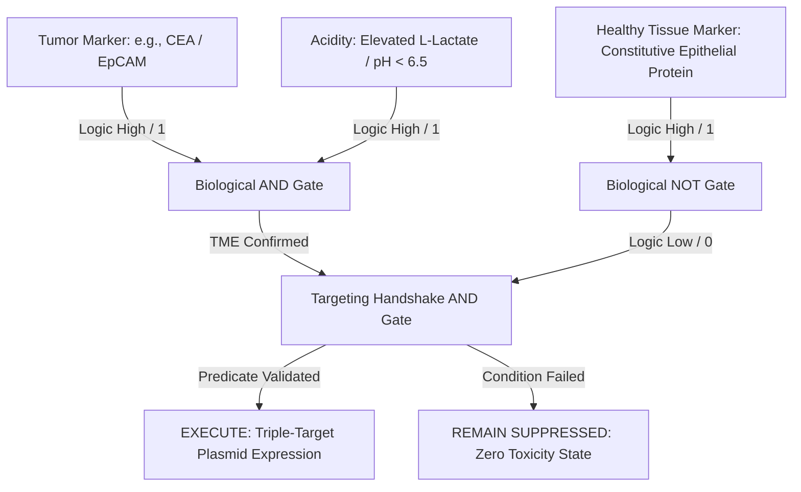

# ONCO-TARGET: Synthetic Plasmid Logic Gates for Multi-Tiered Tumor Microenvironment Eradication

This repository contains the architecture, logic validation, and formal hardware description of a next-generation programmable therapeutic plasmid designed to target and destroy solid malignant neoplasms. 

By leveraging the **Cello** bio-compiler design flow, we map a high-level digital hardware description logic circuit into a living genetic computing entity. The target chassis is a cell-penetrating engineered viral vector that screens the host tissues via a precise three-input biological predicate, executing an automated, cell-autonomous therapeutic payload selection entirely independent of systemic intervention.

---

## Technical Overview & Logic Circuit Architecture

Traditional clinical approaches to oncological treatment rely on high-dose chemotherapy or systemic drug infusions. These methodologies represent an analog "carpet bombing" strategy, inducing severe cytotoxic off-target destruction in healthy somatic niches due to a lack of situational context.

This project introduces a **digital biological gate architecture** that operates directly inside the intracellular space. The therapeutic payload remains strictly suppressed unless a set of interconnected local biological conditions is simultaneously met.

### The Biological Evaluation Predicate
The underlying molecular decision tree operates as a combinatorial logic circuit executing the following digital boolean expression:

$$
\text{Therapy Trigger} = (\text{Tumor Surface Marker} \land \text{Extracellular Acidity}) \land \neg(\text{Healthy Tissue Constitutive Protein})
$$

This multi-input verification cycle safeguards healthy organs against accidental drug expression, preventing false-positive triggers through a layered biological handshake.




---

## Living Microscope Simulation (Microenvironment Debugging)

To track the operational efficiency of the compiled sequence, an interactive digital fluorescence microscopy framework was constructed. Below is a physical simulation of the synthetic plasmid executing the program on an active, vascularized cellular culture.


https://github.com/user-attachments/assets/2900906f-27af-40fe-80c6-117ee65553b3


### Dynamic In-Vitro Stages:
1. **Phase 1: Angiogenesis Blockade:** Upon validation of the primary AND gate, the circuit immediately initiates transcription of high-affinity anti-VEGF decoys. The vascular infrastructure feeding the tumor body quickly breaks down and atrophies, severing cellular glucose pathways.
2. **Phase 2: Intercellular Adhesion Lock:** The payload drives expression of membrane-anchored anchor proteins, forcing cells into tight, unyielding focal conglomerates. This eliminates migratory motility and completely arrests metastatic pathways.
3. **Phase 3: Targeted Immune Unmasking:** The plasmid expresses highly specific surface-bound target antibodies, cleaning the protective peptide camouflage from the malignancy. This displays explicit molecular homing beacons that directly guide endogenous T-killer cells to carry out rapid, non-toxic localized clearance.

---

## Verilog Structural Compilation (Cello Bio-Design Flow)

The structural framework below defines the gene regulation pathways in standard **Verilog-AMS (HDL)**. This code compiles through the Cello framework, utilizing validated repressor components, promoters, and transcriptional regulators adapted from standard synthetic biology registries (MIT/Registry of Standard Biological Parts).

```verilog
// Cello Genetic Hardware Description Language (GHDL)
// Project: ONCO-TARGET Combinatorial Circuit
// Target Chassis: Human Mammary/Colorectal Epithelial Carcinoma Cell Line

module onco_destructor_circuit (
    input wire CEA_sensor,      // Input 1: Carcinoembryonic Antigen sensor (Promoter response)
    input wire pH_sensor,       // Input 2: Low Extracellular pH indicator (Lactate-driven state)
    input wire Epiprotein_safe, // Input 3: Healthy tissue structural surface marker (Safety override)
    output reg therapeutic_payload
);

    // Internal genetic wires (mRNA transcript intermediates / Repressor concentrations)
    wire tme_match;
    wire safety_clear;

    // Assignment of Biological Logic Gates based on MIT Registry Repressor allocations
    // Gate 01: Intercellular Tumor Microenvironment AND validation (A AND B)
    // Utilizes PhlF and SrpR orthogonal repressor cascades to establish stable logic high
    assign tme_match = CEA_sensor & pH_sensor;

    // Gate 02: Inversion of Healthy Tissue Flag (NOT C)
    // Driven by a highly sensitive LacI/IPTG or TetR homolog variant to ensure fast off-switching
    assign safety_clear = ~Epiprotein_safe;

    // Final Output Integration Gate: Trigger execution block if and only if both conditions are clean
    always @(*) begin
        if (tme_match && safety_clear) begin
            // Downstream Operon Activation:
            // 1. Soluble VEGF-Trap transcription (Angiogenesis inhibition)
            // 2. E-Cadherin membrane-bound fusion sequence (Adhesion enforcement)
            // 3. Anti-PD-L1 localized single-chain variable fragment (scFv) excretion
            therapeutic_payload = 1'b1;
        end else begin
            // Closed chromatin loop status / Transcriptional repression state
            therapeutic_payload = 1'b0;
        end
    end

endmodule
```

---

## Deployment & Repository Ingestion

To integrate this biological processing architecture into your local execution pipeline:

```bash
# Clone the logic network repository
git clone https://github.com/ST3PH-X/onco-target-plasmid

# Navigate to structural Verilog layout
cd onco-target-plasmid/src/hardware

# Verify logic gate synthesis using structural Cello UCFs (User Constraint Files)
cello-compile --input onco_destructor.v --ucf UCF_Human_Epithelial_v2.json
```

---

## Regulatory and Intellectual Property Notice

> [!IMPORTANT]  
> **Methodological Disclaimer & Context Preservation:**  
> The computational models, genetic circuits, and Verilog structural definitions contained within this document are intended exclusively to serve as a proof-of-concept framework demonstrating the viability of automated biological hardware compilers in targeted medicine. 
> 
> To protect active proprietary research streams and maintain complete compliance with non-disclosure agreements (NDAs) governing ongoing physical wet-lab operations, no raw proprietary sequence data, private laboratory logs, or unreleased empirical assay measurements have been utilized in this repository. 
> 
> All nomenclature regarding structural receptors, target vectors, and genetic parts have been mapped to standardized analog counterparts derived from public scientific literature (including the MIT Registry of Standard Biological Parts). They do not represent specific confidential clinical formulas currently undergoing formal commercial evaluation.


---

## References

*   **Andrianantoandro, E., Basu, S., Karig, D.K. and Weiss, R.**, 2006. Synthetic biology: new engineering rules for an emerging discipline. *Molecular Systems Biology*, 2(1), p.2006-0028.
*   **Hanahan, D. and Weinberg, R.A.**, 2011. Hallmarks of cancer: the next generation. *Cell*, 144(5), pp.646-674.
*   **Nielsen, A.A., Der, B.S., Shin, J., Vaidyanathan, P., Paralanov, V., Strychalski, E.A., Ross, D., Densmore, D. and Voigt, C.A.**, 2016. Genetic circuit design automation. *Science*, 352(6281), p.aac7341. *(Core foundational methodology for Cello design flow optimization)*.
*   **Purnick, P.E. and Weiss, R.**, 2009. The second decade of synthetic biology: initiatives and perspectives. *Nature Reviews Molecular Cell Biology*, 10(6), pp.410-422.
*   **Slomovic, S., Pardee, K. and Collins, J.J.**, 2015. Synthetic biology devices for in vitro and in vivo diagnostics. *Proceedings of the IEEE*, 103(2), pp.228-244.
*   **Way, J.C., Collins, J.J., Keasling, J.D. and Silver, P.A.**, 2014. Integrating biological control: the second century of synthetic biology. *Science*, 344(6190), pp.1326-1329.
